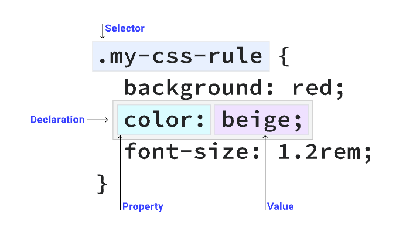

# 1. Box model

- everything displayed by CSS is a box
## Content and sizing 
- content will affect the size of the box by default
- Extrinsic sizing vs intrinsic sizing

```html
<p class="box" data-element="awesome">CSS is awesome</p>
```
```css
.box{
    width: 320px;
}
.box[data-sizing="intrinsic"]{
    width:min-content;
}
```
```js
const awesome = document.querySelector('[data-element="awesome"]');
const intrinsicSwitch = document.querySelector("#intrinsic-switch");

intrinsicSwitch.addEventListener("change", () => {
  awesome.setAttribute(
    "data-sizing",
    intrinsicSwitch.checked ? "intrinsic" : "extrinsic"
  );
});
```
- One way to prevent this overflow is to allow the box to be intrinsically sized by either unsetting the width
- The `min-content` keyword tells the box to only be as wide as the intrinsic minimum width of its content

## The areas of the box model

- content: có thể control the size of it parent
- padding box: bọc quanh content box, vì nằm trong box nên bg của box sẽ hiển thị luôn ở đây
  + overflow: auto /\ scroll
- border box: bọc quanh padding box
- margin box: phần cuối của box.
  + outline /\ box-shadow

- mặc định thì box-sizing là 'content-box': khi set width và height thì nó sẽ áp dụng cho content-box, và nếu thêm padding và border thì xsẽ thêm vào content-box size
```css
.my-box {
  width: 200px;
  border: 10px solid;
  padding: 20px;
}
/* content-box là 200, vì thêm vào padding và border nên là 260px */

.my-box {
  box-sizing: border-box;
    width: 200px;
    border: 10px solid;
    padding: 20px;
}
/* dùng border-box để kích thước luôn là 200px và border và padding sẽ thêm vào và vẫn giữ nguyên 200px */

*,
*::before,
*::after {
  box-sizing: border-box;
}
/* làm vậy để tất cả element  trong website sẽ có chung một kiến trúc box model */
```

# 2. Selector
## The parts of a css rule


```css
/* universal selector */
* {
  color: hotpink;
}

type selector
section {
  padding: 2em;
}

/* class selector */
.my-class {
  color: red;
}

/* ID selector */
#rad {
  border: 1px solid blue;
}

/* attribute selector */
[data-type='primary'] {
  color: red;
}
/* /accept on all element like */
<div data-type="primary"></div>

/* grouping selector */
strong,
em,
.my-class,
[lang] {
  color: red;
}
```
## Pseudo-classes

```css
/* Our link is hovered */
a:hover {
  outline: 1px dotted green;
}

/* Sets all even paragraphs to have a different background */
p:nth-child(even) {
  background: floralwhite;
}
```
## Pseudo-element
```css
.my-element::before {
  content: 'Prefix - ';
}
```
## Complex selectors
### Combinators

```css
/* Descendant combinator */
/* nhắm vào ptử con */
p strong {
  color: blue;
}

/* Next sibling combinator */
/* Subsequent- sibling combinator */
/* Child combinator */
/* Compound selectors */
```
# 3. specificity
- *:              0 point
- pseudo-element: 1 point
- class, pseudo-class, attribute selector:  10 point
- ID selector:  100 point
- inline style: 1000 point
- !important rule: 10,000 point
```css
/* 1 point */
a {
  color: red;
}

/* 11 point */
a.my-class {
  color: green;
}

/* 21 point */
a.my-class.another-class {
  color: rebeccapurple;
}

/* 31 point */
a.my-class.another-class[href] {
  color: goldenrod;
}

/* 41 point */
a.my-class.another-class[href]:hover {
  color: lightgrey;
}
```


