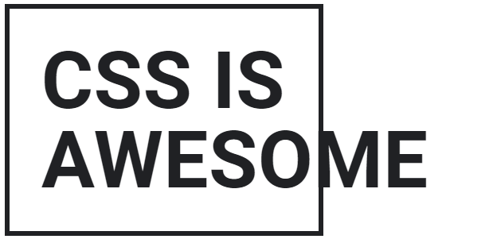
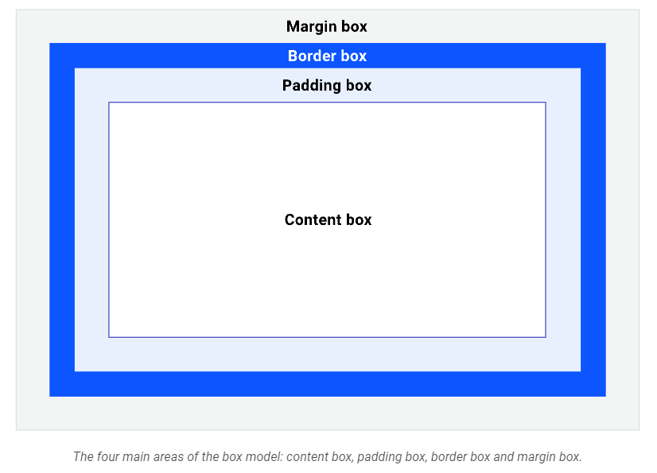

# 1. Box model

- everything displayed by CSS is a box
## Content and sizing 
- content will affect the size of the box by default
- Extrinsic sizing vs intrinsic sizing

```html
<p class="box" data-element="awesome">CSS is awesome</p>
```
```css
.box{
    width: 320px;
}
.box[data-sizing="intrinsic"]{
    width:min-content;
}
```
```js
const awesome = document.querySelector('[data-element="awesome"]');
const intrinsicSwitch = document.querySelector("#intrinsic-switch");

intrinsicSwitch.addEventListener("change", () => {
  awesome.setAttribute(
    "data-sizing",
    intrinsicSwitch.checked ? "intrinsic" : "extrinsic"
  );
});
```
- One way to prevent this overflow is to allow the box to be intrinsically sized by either unsetting the width
- The `min-content` keyword tells the box to only be as wide as the intrinsic minimum width of its content

## The areas of the box model

- padding box: The padding box surrounds the content box and is the space created by the padding property
- border box: The border box surrounds the padding box and its space is occupied by the border value


