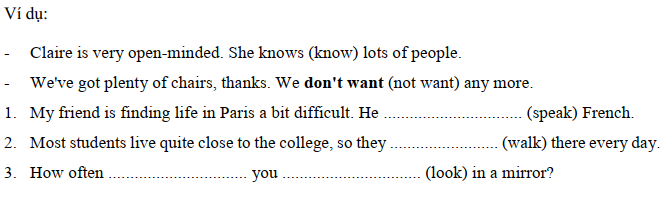
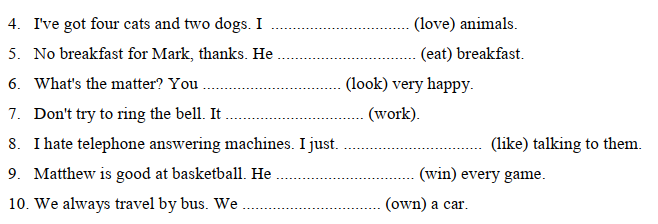
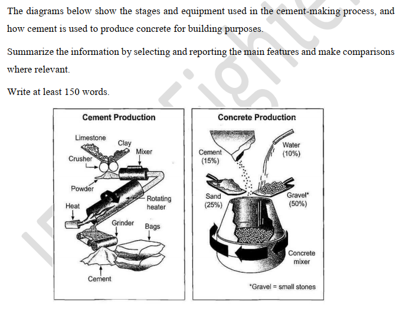
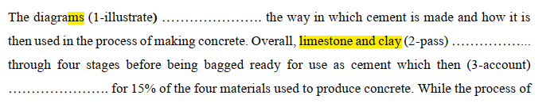
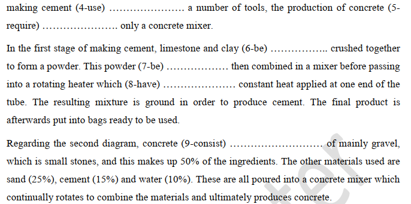

Ex1: chuyển đổi câu(khẳng định, phủ định, nghi vấn)
- We go shopping every weekend
-
-

-
-
- Does it rain every afternoon in the hot season?

-
- They don't like to hang out during weekdays
- 

- The Earth revolves around the Sun
-
-

- She only eats fish
- 
- 

-
-
- How often do they watch movie?

-
-
- Does he drink tea for breakfast?

-
- I don't know how to play piano
-

- Your exam start at 9:00
-
-

-
-
- Is LonDon a large city?

Ex2: chia động từ
- My brother always ... Saturday dinner. (make)
- Ruth ... eggs; they ... her ill.(not eat; make)
- 'Have you got a light, by any chance?''Sorry, I ... '(smoke)
- ... Mark ... to school every day?(go)
- ... your parents ... your boyfriend?(like)
- How often .. you .. hiking?(go)
- Where ... your sister ... ?(work)
- Ann ... usually ... lunch(not have)
- Who ... the ironing in your house?(do)
- We ... out once a week(hang)

Ex3: Hoàn thành câu

Ex4: Chia động từ

