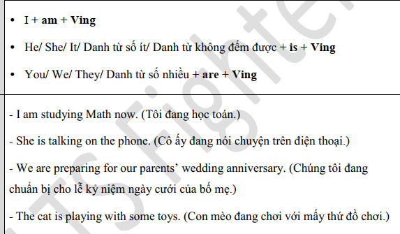
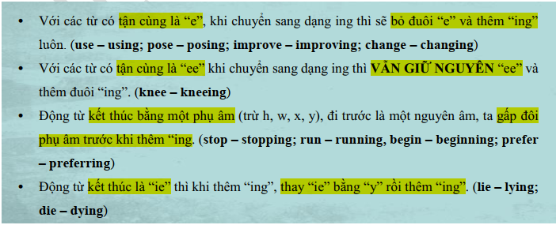
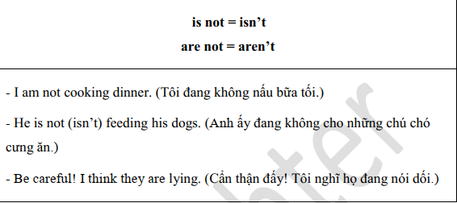
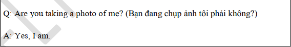
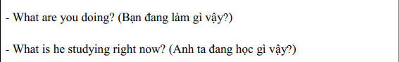
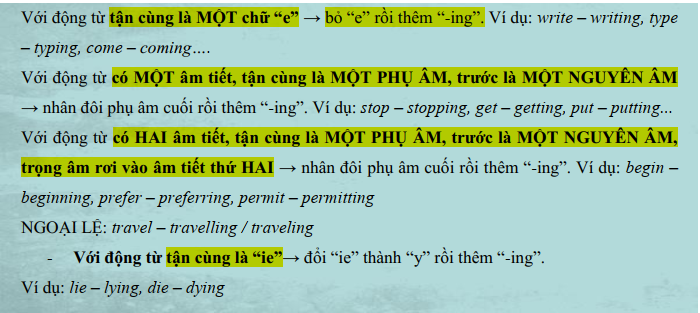
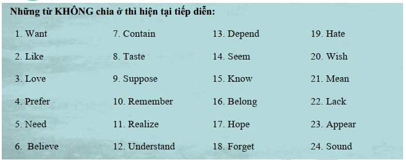
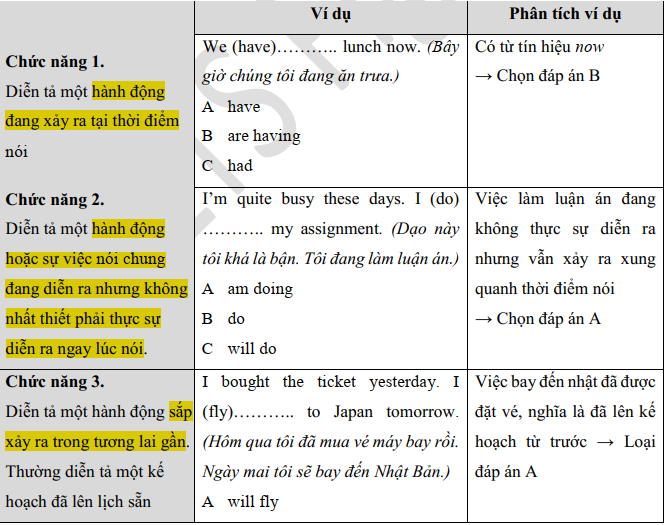
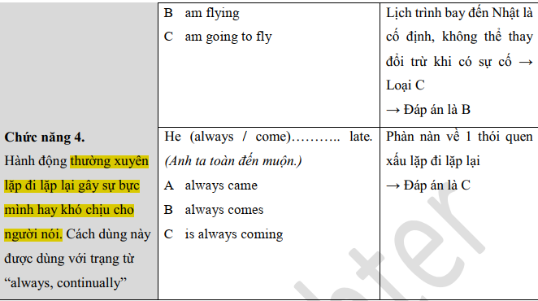
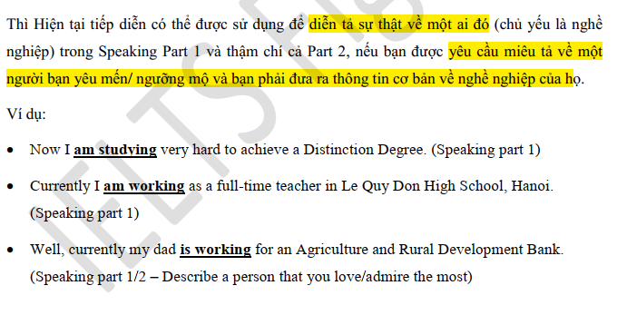

1. Công thức
    + Câu khẳng định
        + S + AM/IS/ARE + V_ING

    + Câu phủ định
        + S + AM/IS/ARE + NOT + V_ING

        

    + Câu nghi vấn
        + AM/IS/ARE + S + V_ING?
        + YES, S + AM/IS/ARE
        + NO, S + AM/IS/ARE + NOT
        

        + WH + AM/IS/ARE(NOT) + S + V_ING?
        

        

    + DẤU HIỆU NHẬN BIẾT
        + Trạng từ chỉ thời gian: now, right now, at the moment, at present, it's time now
        + động từ: look, listen, keep silent

        

    + CHỨC NĂNG
        

        

    + DÙNG TRONG IELTS
        

