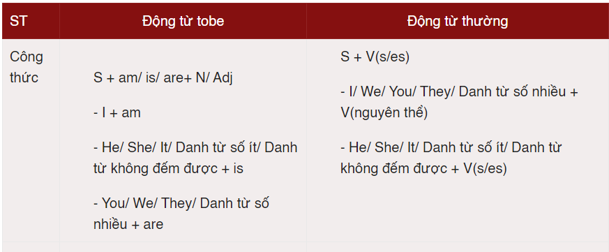
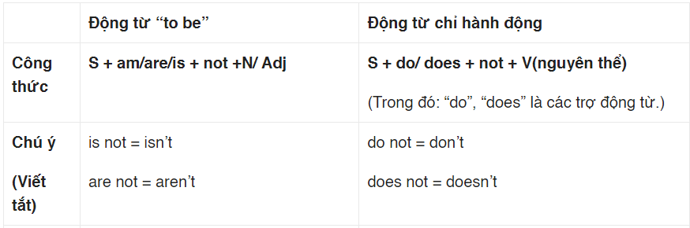
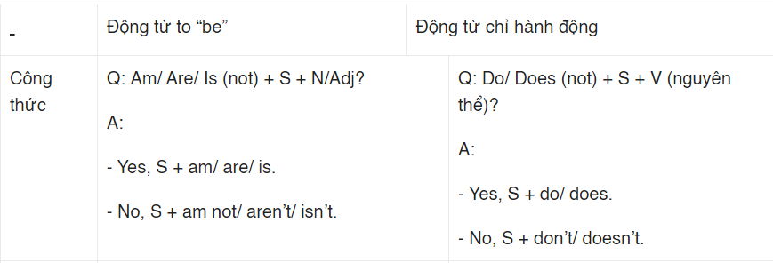
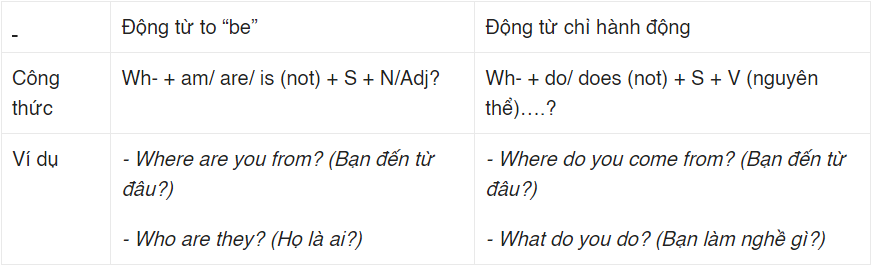

1. Định nghĩa
- diễn tả 1 thói quen/ hành động được lặp đi, lặp lại trong hiện tại
- chân lý, điều hiển nhiên

2. CÔng thức
- câu khẳng định
    

    - ví dụ
        V_tobe
            + I am an engineer
            + He is a lecturer
            + The car is expensive
            + they are students
        V_Thường
            + I often go to school on foot
            + She does yoga every evening
            + The Sun sets in the West
    
    - từ tận cùng là [o,ch,sh,x,s] khi dùng với ngôi số ít --> thêm đuôi "es"
    - từ tận cùng là [y] khi dùng với ngôi số ít, bỏ y và thêm 'ies'
    - các từ còn lại thêm s

- câu phủ định

    - ví dụ:
        V_tobe
            + I am not an engineer
            + He is not a lecturer
            + The car is not expensive
        V thường
            + I do not often go to school on foot
            + She does not do yoga every evening
            + The Sun does not set in the South

- câu nghi vấn
+ yes/no
    
    ví dụ:
        + Are you an engineer?
            Yes, i am
            No, I am not
        + Does she go to work by taxi?
            Yes, she does
            No, she doesn't

+ Wh?

3. Dấu hiệu nhận biết
- trạng từ chỉ tần suất
    + always, constantly
    + usually, frequently
    + often, occasionally
    + sometimes
    + seldom, rarely
    + every day/week/month

4. Cách dùng
- diễn tả 1 hành động or thói quen lặp đi lặp lại trong hiện tại
- diễn tả 1 chân lý, sự thật hiển nhiên
- nói về lịch trình có sẵn, chương trình, thời gian biểu cố định
- dùng trong câu điều kiện loại I

5. cụm từ dùng trong IELTS
6. dùng HTD trong bài thi IELTS

