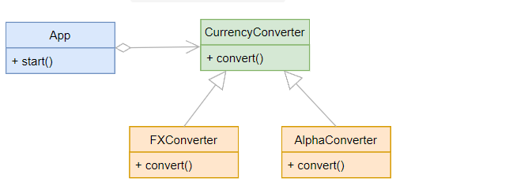

1. Class and Object
1.1 what

```py
# define a class
class Person:

    # class attribute. share by all instance of the class
    counter = 0

    # define instance attributes
    def __init__(self, nme, age):
        self.name = name
        self.age = age

    # instance method
    def greet(self):
        return f"Hi, it's {self.name}"

    # class method. share by all instance of the class
    #  first parameter is cls which represent current class object
    @classmethod
    def create_anonym(cls):
        return Person('Anonym', 22)

    # static method
    @staticmethod
    def calculate_sum(a, b):
        return a + b


person = Person('Huy', 25)
anonym = Person.create_anonym()
f = Person.calculate_sum(1,2)

# single inheritance (kế thừa)
## child class can access the attribute and method of the parent class
class Employee(Person):
    def __init__ (self, name, age,job_tile):
        super().__init__(name,age)
        self.job_title= job_tile

    # override the greet() class
    def greet(self):
        return super().greet() + f"I'm a {self.job_title}"
```

1.2 Class

```py
# object chứa data à functionality
## data đại diện cho object tại 1 thời điểm. data của object => state. dùng attribute để mô hình hóa state của object
## Functionality đại diện cho behaviors(hành vi) của object. dùng fn để mô hình hóa. fn được kiên kết với object => method của object
## ==> object chứa state và method

# object của class là các instances của class
class Person:
    pass    # thêm vào sau

person = Person()
print(person)

# get an identity of an object
## id is unique
## return a  number that represents the memory address of this object
print(id(person))       # 1943155787760
print(hex(id(person)))  # 0x1c46d1c47f0
```

1.3 Class variable

```py
class HtmlDocument:
    extension = 'html'
    version = '5'

# get value of class variable
print(HtmlDocument.extension) # html
print(HtmlDocument.version) # 5

# using getattr()
extension = getattr(HtmlDocument, 'extension')
version = getattr(HtmlDocument, 'version')

print(extension)  # html
print(version)  # 5

# set values
HtmlDocument.version = 10

setattr(HtmlDocument, 'version', 10)

# can add class variable after create

# delete class variable
delattr(HtmlDocument, 'version')

del HtmlDocument.version

# class variable storage
## store in __dict__. it mapping proxy
## can't change __dict__ directly
from pprint import pprint

class HtmlDocument:
    extension = 'html'
    version = '5'
HtmlDocument.media_type = 'text/html'
pprint(HtmlDocument.__dict__)
# mappingproxy({'__dict__': <attribute '__dict__' of 'HtmlDocument' objects>,
#               '__doc__': None,
#               '__module__': '__main__',
#               '__weakref__': <attribute '__weakref__' of 'HtmlDocument' objects>,
#               'extension': 'html',
#               'media_type': 'text/html',
#               'version': '5'})

```

1.4 class method

```py
class Request:
    def send():
        print('Sent')

Request.send() # Sent
print(Request.send) # <function Request.send at 0x00000276F9E00310>

print(type(Request.send)) # <class 'function'>

# create new instance of Request
http_request = Request()
print(http_request.send) # <bound method Request.send of <__main__.Request object at 0x00000104B6C3D580>>

## http_request.send is not a fn like Request.send
print(type(http_request.send))  # <class 'method'>
print(type(Request.send))  # <class 'function'>

http_request.send() # TypeError.
## Because the http_request.send is a method that is bound to the http_request object, Python always implicitly passes the object to the method as the first argument

class Request:
    def send(*args):
        print('Sent', args)

Request.send() # Sent ()
## send() fn ko nhận bất kì argument(đối số) nào

http_request.send() # Sent (<__main__.Request object at 0x000001374AF4D580>,)

print(hex(id(http_request)))
http_request.send()
# output:
0x1ee3a74d580
Sent (<__main__.Request object at 0x000001EE3A74D580>,)

http_request.send()
# bằng với
Request.send(http_request)

# method của 1 object luôn có object làm argument đầu tiên. call 'self'
class Request:
    def send(self):
        print('Sent', self)

# 'self' like 'this' in other language
```

1.5 **init**

```py
# __init__ auto call when create a new object of a class
class Person:
    def __init__(self, name, age = 25):
        self.name = name
        self.age = age


if __name__ == '__main__':
    person = Person('John', 25)
    print(f"I'm {person.name}. I'm {person.age} years old.")

```

1.6 instance variable

```py
from pprint import pprint

class HtmlDocument:
    version = 5
    extension = 'html'      # instance variable

pprint(HtmlDocument.__dict__)

print(HtmlDocument.extension)
print(HtmlDocument.version)

# store in __dict__
mappingproxy({'__dict__': <attribute '__dict__' of 'HtmlDocument' objects>,
              '__doc__': None,
              '__module__': '__main__',
              '__weakref__': <attribute '__weakref__' of 'HtmlDocument' objects>,
              'extension': 'html',
              'version': 5})

# create new instance of HtmlDocument class
home = HtmlDocument() # có __dict__ riêng

home.version = 6
print(home.__dict__)    #  {'version': 6}

```

1.6 class method

```py
class Person:
    def __init__(self, first_name, last_name, age):
        self.first_name = first_name
        self.last_name = last_name
        self.age = age

    def get_full_name(self):
        return f"{self.first_name} {self.last_name}"

    def introduce(self):
        return f"Hi. I'm {self.first_name} {self.last_name}. I'm {self.age} years old."

    @classmethod
    def create_anonymous(cls):
        return Person('John', 'Doe', 25)
# instance method: __init__, get_full_name, introduce
# class method: create_anonymous

anonymous = Person.create_anonymous
print(anonymous.introduce)    # Hi. I'm John Doe. I'm 25 years old.

# When a method creates an instance of the class and returns it, the method is called a factory method
# create_anonymous is a factory method => it return a new instance of the Person class
```

1.7 private attribute

```py
# encapsulation(đóng gói)
## packing data and fn work on that data within a single object => hide the state of object from the outside ==> information hiding
## 'class' là 1 ví dụ về encapsulation

# private attributes
## '_attribute'
##'__attribute' (double underscore) => auto transform '_class__attribute' => can not access from outside the class
## EX:
class Counter:
    def __init__(self):
        self.__current = 0

    def increment(self):
        self.__current += 1

    def value(self):
        return self.__current

    def reset(self):
        self.__current = 0

counter = Counter()
print(counter.__current)       # AttributeError: 'Counter' object has no attribute '__current'

print(counter._Counter__current)    # 0
                                ## _Class__Attribute -> private attribute
```

1.8 class attributes
```py
class Circle:
    pi = 3.14159
    def __init__(self, radius):
        self.radius = radius

    def area(self):
        return self.pi * self.radius**2

    def circumference(self):
        return 2*self.pi * self.radius
# 'radius': instance attribute
# 'pi': class attribute

# how class attribute work
## khi truy cập 1 attribute thông qua 1 instance của class => search trong instance attribute list. nếu ko có thì tới class attribute list => return value of instance
## khi truy cập 1 attribute => search trong class attribute list
class Test:
    x = 10

    def __init__(self):
        self.x = 20

test = Test()
print(test.x)  # 20
print(Test.x)  # 10

# define default value
## set default value for all instance of a class => use class attribute
class Product:
    default_discount = 0

    def __init__(self, price):
        self.price = price
        self.discount = Product.default_discount

    def set_discount(self, discount):
        self.discount = discount

    def net_price(self):
        return self.price * (1 - self.discount)

p1 = Product(100)
print(p1.net_price())   # 100

p2 = Product(200)
p2.set_discount(0.05)
print(p2.net_price())   # 190

# A class attribute is shared by all instances of the class
# Use 'class_name.class_attribute' or 'object_name.class_attribute' to access the value of the 'class_attribute'
# Use class attributes for: 
## storing class contants, 
## track data across all instances
## setting default values for all instances of the class
```
1.9 static method
```py
# static method cannot access and modify an object state
# static method cannot access and modify te class state
class className:
    @staticmethod
    def static_method_name(param_list):
        pass

className.static_method_name()
# EX:
class TemperatureConverter:
    FAHRENHEIT = 'F'
    CELSIUS = 'C'

    @staticmethod
    def celsius_to_fahrenheit(c):
        return 9*c/5 + 32

    @staticmethod
    def fahrenheit_to_celsius(f):
        return 5*(f-32)/9

    @staticmethod
    def format(value, unit):
        symbol = ''
        if unit == TemperatureConverter.FAHRENHEIT:
            symbol = '°F'
        elif unit == TemperatureConverter.CELSIUS:
            symbol = '°C'

        return f'{value}{symbol}'

f = TemperatureConverter.celsius_to_fahrenheit(35)
print(TemperatureConverter.format(f, TemperatureConverter.FAHRENHEIT))

# use static method to define utility method or group a logically related fn nto a class

```
2. special method
2.1 __str__
```py
class Person:
    def __init__(self, first_name, last_name, age):
        self.first_name = first_name
        self.last_name = last_name
        self.age = age
person = Person('John', 'Doe', 25)
print(person) # output: <__main__.Person object at  0x7f6c9d4baf80> # memory address of that instance

class Person:
    def __init__(self, first_name, last_name, age):
        self.first_name = first_name
        self.last_name = last_name
        self.age = age

    def __str__(self):
        return f'Person({self.first_name},{self.last_name},{self.age})'
person = Person('John', 'Doe', 25)
print(person)    # output: Person(John,Doe,25)
```
2.2 __repr__
```py
# return the string representation(đại diện) cho object
class Person:
    def __init__(self, first_name, last_name, age):
        self.first_name = first_name
        self.last_name = last_name
        self.age = age
person = Person('John', 'Doe', 25)
print(repr(person)) # memory address of the 'person'

class Person:
    def __init__(self, first_name, last_name, age):
        self.first_name = first_name
        self.last_name = last_name
        self.age = age

    def __repr__(self):
        return f'Person("{self.first_name}","{self.last_name}",{self.age})'
person = Person("John", "Doe", 25)
print(repr(person)) # Person("John","Doe",25) 

print(person) # Person("John","Doe",25) => nếu ko co __str__ thì return về __repr__ vì __str__ gọi __repr__

# Ex: nếu có __str__ => return __str__
class Person:
    def __init__(self, first_name, last_name, age):
        self.first_name = first_name
        self.last_name = last_name
        self.age = age

    def __repr__(self):
        return f'Person("{self.first_name}","{self.last_name}",{self.age})'

    def __str__(self):
        return f'({self.first_name},{self.last_name},{self.age})'

person = Person('John', 'Doe', 25)
# use str()
print(person)   # (John,Doe,25)

# use repr()
print(repr(person)) # Person("John","Doe",25)

# khác nhau __str__ vs __repr__
## intended audiences(đối tượng mục tiêu)
### __str__ returns a string representation of an object that is human-readable
### __repr__ returns a string representation of an object that is machine-readable
```
2.3 __eq__
```py
# auto call __eq__ when use the '==' operator to compare the instance of a class
class Person:
    def __init__(self, first_name, last_name, age):
        self.first_name = first_name
        self.last_name = last_name
        self.age = age

    def __eq__(self, other):
        return self.age == other.age
john = Person('John', 'Doe', 25)
jane = Person('Jane', 'Doe', 25)
print(john == jane)  # True

john = Person('John', 'Doe', 25)
mary = Person('Mary', 'Doe', 27)
print(john == mary)  # False

john = Person('John', 'Doe', 25)
print(john == 20) # AttributeError: 'int' object has no attribute 'age'
```
2.4 __hash__
```py
# hash() accept an object and return the hash value as an integer
class Person:
    def __init__(self, name, age):
        self.name = name
        self.age = age
p1 = Person('John', 22)
p2 = Person('Jane', 22)

print(hash(p1))    # 110373112736
print(hash(p2))    # 110373572343

# when pass 'p1' to hash() => auto call __hash__ of the 'p1' object
hash(p1)
# auto call
p1.__hash__()

```
2.5 __bool__
```py
# an object of a custom class đều có g/tri boolean(default = true)
# __bool_ return boolean value(T or F)

# __len__: if custom class doesn't have the __bool__ => look for the __len__(). if __len__ zero => object false. otherwise True
class Payroll:
    def __init__(self, length):
        self.length = length

    def __len__(self):
        print('len was called...')
        return self.length


if __name__ == '__main__':
    payroll = Payroll(0)
    print(bool(payroll))  # False

    payroll.length = 10
    print(bool(payroll))  # True
```
2.6 __del__
```py
# the garbage collector manages memory automatically
# The garbage collector will destroy the objects that are not referenced

# If an object implements the __del__ method, Python calls the __del__ method right before the garbage collector destroys the object

# __del__ is not the destructor because the garbage collector destroys the object, not the __del__ method

class Person:
    def __init__(self, name, age):
        self.name = name
        self.age = age

    def __del__(self):
        print('__del__ was called')


if __name__ == '__main__':
    person = Person('John Doe', 23)
    person = None
# When we set the person object to None, the garbage collector destroys it because there is no reference. Therefore, the __del__ method was called.


```
2.7 Operator Overloading
```py
```
3. property
3.1 Property
```py
# getter and setter: provide an interface for accessing an instance attribute
## getter => return value attribute
## setter => set a new value for an attribute
class Person:
    def __init__(self, name, age):
        self.name = name
        self.set_age(age)

    def set_age(self, age):
        if age <= 0:
            raise ValueError('The age must be positive')
        self._age = age

    def get_age(self):
        return self._age

john = Person('John', 18)
john.set_age(-19)

# To define a getter and setter method while achieving(đạt được) backward compatibility(tương thích), you can use the property() class
# property class return property object
property(fget=None, fset=None, fdel=None, doc=None)
## fget: getter
## fset: setter
## fdel: a fn delete attribute
## doc: docstring(comment)

class Person:
    def __init__(self, name, age):
        self.name = name
        self.age = age

    def set_age(self, age):
        if age <= 0:
            raise ValueError('The age must be positive')
        self._age = age

    def get_age(self):
        return self._age

    age = property(fget=get_age, fset=set_age)
# create a new property object  and assign it to the 'age' attribute of the Person class
# age is class attribute, not instance attribute
print(Person.age)   # <property object at 0x000001F5F5149180>

john = Person('John', 18)
print(john.__dict__)    # {'_age': 18, 'name': 'John'}

# assign a value to the age object
john.age = 19
# look up the 'age' in the john.__dict__ first => not found
# then  look up the '_age' in the Person.__dict__ => found
pprint(Person.__dict__)
# mappingproxy({'__dict__': <attribute '__dict__' of 'Person' objects>,
#               '__doc__': None,
#               '__init__': <function Person.__init__ at 0x000002242F5B2670>,
#               '__module__': '__main__',
#               '__weakref__': <attribute '__weakref__' of 'Person' objects>,
#               'age': <property object at 0x000002242EE39180>,
#               'get_age': <function Person.get_age at 0x000002242F5B2790>,
#               'set_age': <function Person.set_age at 0x000002242F5B2700>})

# then call the function assigned to the 'fset' argument, which is the 'set_age()'
# read from the ;age' property object, Python will execute the function assigned to the 'fget' argument, which is the 'get_age()' method

==> By using the property() class, we can add a property to a class while maintaining backward compatibility
```

3.3 Property Decorator
```py
class Person:
    def __init__(self, name, age):
        self.name = name
        self._age = age

    @property
    def age(self):
        return self._age

    age = property(fget=age) # có thể bỏ đi thay bằng @property phía trên, tính chất không thay đổi

    @age.setter
    def age(self, value):
        if value <= 0:
            raise ValueError('The age must be positive')
        self._age = value

    age = age.setter(set_age) # có thể bỏ đi thay bằng @property phía trên, tính chất không thay đổi

# EX1:
class MyClass:
    def __init__(self, attr):
        self.prop = attr

    @property
    def prop(self):
        return self.__attr

    @prop.setter
    def prop(self, value):
        self.__attr = value

#EX2:
class Person:
    def __init__(self, name, age):
        self.name = name
        self.age = age

    @property
    def age(self):
        return self._age

    @age.setter
    def age(self, value):
        if value <= 0:
            raise ValueError('The age must be positive')
        self._age = value

    @property
    def name(self):
        return self._name

    @name.setter
    def name(self, value):
        if value.strip() == '':
            raise ValueError('The name cannot be empty')
        self._name = value
```
3.4 Readonly Property
```py
# To define a readonly property, you need to create a property with only the getter
# However, it is not truly read-only because you can always access the underlying attribute and change it

# The read-only properties are useful in some cases such as for computed properties
import math

class Circle:
    def __init__(self, radius):
        self.radius = radius

    @property
    def area(self):
        return math.pi * self.radius ** 2


c = Circle(10)
print(c.area)

# EX2: recalculate the area of the circle only when the radius changes. If the radius doesn’t change, you can reuse the previously calculated area
import math


class Circle:
    def __init__(self, radius):
        self._radius = radius
        self._area = None

    @property
    def radius(self):
        return self._radius

    @radius.setter
    def radius(self, value):
        if value < 0:
            raise ValueError('Radius must be positive')

        if value != self._radius:
            self._radius = value
            self._area = None

    @property
    def area(self):
        if self._area is None:
            self._area = math.pi * self.radius ** 2

        return self._area

# Define only the getter to make a property readonly
# Do use computed property to make the property of a class more natural
# Use caching computed properties to improve the performance.
```
3.5 Delete Property
```py
# the @property decorator uses the property class that has three methods: setter, getter, and deleter

from pprint import pprint


class Person:
    def __init__(self, name):
        self._name = name

    @property
    def name(self):
        return self._name

    @name.setter
    def name(self, value):
        if value.strip() == '':
            raise ValueError('name cannot be empty')
        self._name = value

    @name.deleter
    def name(self):
        del self._name

# deleter() method deletes a property of an object, not a class.
pprint(Person.__dict__)
mappingproxy({'__dict__': <attribute '__dict__' of 'Person' objects>,
              '__doc__': None,
              '__init__': <function Person.__init__ at 0x000001DC41D62670>,
              '__module__': '__main__',
              '__weakref__': <attribute '__weakref__' of 'Person' objects>,
              'name': <property object at 0x000001DC41C89130>})

person = Person('John')
pprint(person.__dict__) # {'_name': 'John'}

del person.name
pprint(person.__dict__) #  {}

print(person.name) # AttributeError: 'Person' object has no attribute '_name'
```

4. single inheritance
4.1 Inheritance
```py
# Inheritance(kế thừa) allows a class to reuse the logic of an existing class
class Person:
    def __init__(self, name):
        self.name = name

    def greet(self):
        return f"Hi, it's {self.name}"

# Employee inherits person
class Employee(Person):
    def __init__(self, name, job_title):
        self.name = name
        self.job_title = job_title

# type vs isinstance
person = Person('Jane')
print(type(person))     # <class '__main__.Person'>
print(isinstance(person, Person)) #  True


employee = Employee('John', 'Python Developer')
print(type(employee))   # <class '__main__.Employee'>
print(isinstance(employee, Person))  # True
print(isinstance(employee, Employee))  # True
print(isinstance(person, Employee))  # False

print(issubclass(Employee, Person)) # True

class SalesEmployee(Employee):
    pass

print(issubclass(SalesEmployee, Employee)) # True
print(issubclass(SalesEmployee, Person)) # True

# define a class that doesn’t inherit from any class, it’ll implicitly inherit from the built-in object class
print(issubclass(Person, object)) # True

# ==>  all classes are subclasses of the object class
```
4.2 Overriding method
```py
class Employee:
    def __init__(self, name, base_pay):
        self.name = name
        self.base_pay = base_pay

    def get_pay(self):
        return self.base_pay


class SalesEmployee(Employee):
    def __init__(self, name, base_pay, sales_incentive):
        self.name = name
        self.base_pay = base_pay
        self.sales_incentive = sales_incentive

    def get_pay(self):
        return self.base_pay + self.sales_incentive


if __name__ == '__main__':
    john = SalesEmployee('John', 5000, 1500)
    print(john.get_pay())   # 6500

    jane = Employee('Jane', 5000)
    print(jane.get_pay())   # 5000

# EX2: 
import re


class Parser:
    def __init__(self, text):
        self.text = text

    def email(self):
        match = re.search(r'[a-z0-9\.\-+_]+@[a-z0-9\.\-+_]+\.[a-z]+', self.text)
        if match:
            return match.group(0)
        return None

    def phone(self):
        match = re.search(r'\d{3}-\d{3}-\d{4}', self.text)
        if match:
            return match.group(0)
        return None

    def parse(self):
        return {
            'email': self.email(),
            'phone': self.phone()
        }


class UkParser(Parser):
    def phone(self):
        match = re.search(r'(\+\d{1}-\d{3}-\d{3}-\d{4})', self.text)
        if match:
            return match.group(0)
        return None


if __name__ == '__main__':
    s = 'Contact us via 408-205-5663 or email@test.com'
    parser = Parser(s)
    print(parser.parse())

    s2 = 'Contact me via +1-650-453-3456 or email@test.co.uk'
    parser = UkParser(s2)
    print(parser.parse())

# overriding attribute
import re


class Parser:
    phone_pattern = r'\d{3}-\d{3}-\d{4}'

    def __init__(self, text):
        self.text = text

    def email(self):
        match = re.search(r'[a-z0-9\.\-+_]+@[a-z0-9\.\-+_]+\.[a-z]+', self.text)
        if match:
            return match.group(0)
        return None

    def phone(self):
        match = re.search(self.phone_pattern, self.text)
        if match:
            return match.group(0)
        return None

    def parse(self):
        return {
            'email': self.email(),
            'phone': self.phone()
        }


class UkParser(Parser):
    phone_pattern = r'(\+\d{1}-\d{3}-\d{3}-\d{4})'


if __name__ == '__main__':
    s = 'Contact us via 408-205-5663 or email@test.com'
    parser = Parser(s)
    print(parser.parse())

    s2 = 'Contact me via +1-650-453-3456 or email@test.co.uk'
    parser = UkParser(s2)
    print(parser.parse())
```
4.3 super
```py
class Employee:
    def __init__(self, name, base_pay, bonus):
        self.name = name
        self.base_pay = base_pay
        self.bonus = bonus

    def get_pay(self):
        return self.base_pay + self.bonus


class SalesEmployee(Employee):
    def __init__(self, name, base_pay, bonus, sales_incentive):
        super().__init__(name, base_pay, bonus)
        self.sales_incentive = sales_incentive

    def get_pay(self):
        return super().get_pay() + self.sales_incentive


if __name__ == '__main__':
    sales_employee = SalesEmployee('John', 5000, 1000, 2000)
    print(sales_employee.get_pay())  # 8000

# ==>  Using the `super()` function to call a method of a parent class from a child class
```
4.4 __slots__
```py

```
4.5 abstract classes
```py
# abstract class là class không thể instantiated(khởi tạo)
# có thể tạo class inherit từ class abstract
# create blueprint for other class
# abstract method: method without an implementation
# python ko hỗ trợ trực tiếp abstract
from abc import ABC

class AbstractClassName(ABC):
    pass

# define abstract method
from abc import ABC, abstractmethod

class AbstractClassName(ABC):
    @abstractmethod
    def abstract_method_name(self):
        pass

# Ex1:
from abc import ABC, abstractmethod

class Employee(ABC):
    def __init__(self, first_name, last_name):
        self.first_name = first_name
        self.last_name = last_name

    @property
    def full_name(self):
        return f"{self.first_name} {self.last_name}"

    @abstractmethod
    def get_salary(self):
        pass

## fulltime employee
class FulltimeEmployee(Employee):
    def __init__(self, first_name, last_name, salary):
        super().__init__(first_name, last_name)
        self.salary = salary

    def get_salary(self):
        return self.salary

## part-time employee
class HourlyEmployee(Employee):
    def __init__(self, first_name, last_name, worked_hours, rate):
        super().__init__(first_name, last_name)
        self.worked_hours = worked_hours
        self.rate = rate

    def get_salary(self):
        return self.worked_hours * self.rate

## Payroll class
class Payroll:
    def __init__(self):
        self.employee_list = []

    def add(self, employee):
        self.employee_list.append(employee)

    def print(self):
        for e in self.employee_list:
            print(f"{e.full_name} \t ${e.get_salary()}")

## main
from fulltimeemployee import FulltimeEmployee
from hourlyemployee import HourlyEmployee
from payroll import Payroll

payroll = Payroll()

payroll.add(FulltimeEmployee('John', 'Doe', 6000))
payroll.add(FulltimeEmployee('Jane', 'Doe', 6500))
payroll.add(HourlyEmployee('Jenifer', 'Smith', 200, 50))
payroll.add(HourlyEmployee('David', 'Wilson', 150, 100))
payroll.add(HourlyEmployee('Kevin', 'Miller', 100, 150))

payroll.print()
## output:
John Doe         $6000
Jane Doe         $6500
Jenifer Smith    $10000
David Wilson     $15000
Kevin Miller     $15000

# dùng abstract class ki cần chia sẻ code giữa các class có quan hệ gần nhau [child class của employee đều có full_name property]

```
4.6 Protocol
```py
# define implicit interfaces
from typing import List, Protocol

class Item(Protocol):
    quantity: float
    price: float

class Product:
    def __init__(self, name: str, quantity: float, price: float):
        self.name = name
        self.quantity = quantity
        self.price = price

def calculate_total(items: List[Item]) -> float:
    return sum([item.quantity * item.price for item in items])

# calculate total a product list
total = calculate_total([
    Product('A', 10, 150),
    Product('B', 5, 250)
])
print(total)


class Stock:
    def __init__(self, product_name, quantity, price):
        self.product_name = product_name
        self.quantity = quantity
        self.price = price

# calculate total an inventory list
total = calculate_total([
    Stock('Tablet', 5, 950),
    Stock('Laptop', 10, 850)
])
print(total)

## the Product' and 'Stock' class don’t need to subclass the Item class but still can be used in the calculate_total() function.
```
5. enumeration
5.1
```py
# là tập hợp các unique constant value
from enum import Enum

class Color(Enum):
    RED = 1
    GREEN = 2
    BLUE = 3

print(type(Color.RED))  #  <enum 'Color'>

print(Color.RED.name)      # RED
print(Color.RED.value)     # 1

# enumeration member are always hashable [can use enumeration member as keys in dictionary or element of a Set]
rgb = {
    Color.RED: '#ff0000',
    Color.GREEN: '#00ff00',
    Color.BLUE: '#0000ff'
}
Color.RED
print(Color['RED']) #  Color.RED
print(Color(1))     #  Color.RED
print(Color['RED'] == Color(1)) #  True

# An enumeration is a set of members that have associated unique constant values
# Use the enumeration[member_name] to access a member by its name and enumeration(member_value) to access a member by its value
# Enumerable are immuable
```
5.2 aliases & enum.unique
```py
# can create different member names with the same values
from enum import Enum
class Color(Enum):
    RED = 1
    CRIMSON = 1
    SALMON = 1
    GREEN = 2
    BLUE = 3

print(Color.RED is Color.CRIMSON)   #  True
print(Color.RED is Color.SALMON)    #   True
## CRIMSON and SALMON members are the aliases of the RED member
 
# always get the main member, not aliases
print(Color(1)) # Color.RED

from enum import Enum
from pprint import pprint
class Color(Enum):
    RED = 1
    CRIMSON = 1
    SALMON = 1
    GREEN = 2
    BLUE = 3
pprint(Color.__members__)
# output:
# mappingproxy({'BLUE': <Color.BLUE: 3>,
              'CRIMSON': <Color.RED: 1>,
              'GREEN': <Color.GREEN: 2>,
              'RED': <Color.RED: 1>,
              'SALMON': <Color.RED: 1>})

# 
import enum
from enum import Enum

@enum.unique
class Day(Enum):
    MON = 'Monday'
    TUE = 'Monday'
    WED = 'Wednesday'
    THU = 'Thursday'
    FRI = 'Friday'
    SAT = 'Saturday'
    SUN = 'Sunday'

# ValueError: duplicate values found in <enum 'Day'>: TUE -> MON
```
5.3 customize, extend enum class
```py
from enum import Enum

class PaymentStatus(Enum):
    PENDING = 1
    COMPLETED = 2
    REFUNDED = 3

print(PaymentStatus.PENDING)    # PaymentStatus.PENDING

    def __str__(self):
        return f'{self.name.lower()}({self.value})'

print(PaymentStatus.PENDING)    # pending(1)

# implementing __eq__ method

    def __eq__(self, other):
        if isinstance(other, int):
            return self.value == other

        if isinstance(other, PaymentStatus):
            return self is other

        return False

if PaymentStatus.PENDING == 1:
    print('The payment is pending.')    # The payment is pending.

# implementing __lt__ method
from functools import total_ordering
    def __lt__(self, other):
        if isinstance(other, int):
            return self.value < other

        if isinstance(other, PaymentStatus):
            return self.value < other.value

        return False

## compare with an integer
status = 1
if status < PaymentStatus.COMPLETED:
    print('The payment has not completed')

## compare with another member
status = PaymentStatus.PENDING
if status >= PaymentStatus.COMPLETED:
    print('The payment is not pending')

# implementing __bool__ method
    def __bool__(self):
        if self is self.COMPLETED:
            return True

        return False
for member in PaymentStatus:
    print(member, bool(member))     # pending(1) False
                                    # completed(2) True
                                    # refunded(3) False

# extend enum class
from enum import Enum
from functools import total_ordering


@total_ordering
class OrderedEnum(Enum):
    def __lt__(self, other):
        if isinstance(other, OrderedEnum):
            return self.value < other.value
        return NotImplemented


class ApprovalStatus(OrderedEnum):
    PENDING = 1
    IN_PROGRESS = 2
    APPROVED = 3


status = ApprovalStatus(2)
if status < ApprovalStatus.APPROVED:
    print('The request has not been approved.')

```
5.4 enum auto
```py
from enum import Enum, auto

class State(Enum):
    PENDING = auto()
    FULFILLED = auto()
    REJECTED = auto()

    def __str__(self):
        return f'{self.name(self.value)}'

for state in State:
    print(state.name, state.value)
## output:
PENDING 1
FULFILLED 2
REJECTED 3

# By default, the auto() class generates a sequence of integer numbers starting from 1

# how work
# auto() call _generate_next_value()
_generate_next_value_(name, start, count, last_values)

## EX1:
from enum import Enum, auto


class State(Enum):
    def _generate_next_value_(name, start, count, last_values):
        return name.lower()

    PENDING = auto()
    FULFILLED = auto()
    REJECTED = auto()


for state in State:
    print(state.name, state.value)

## output:
PENDING pending
FULFILLED fulfilled
REJECTED rejected  
```
6. solid principles
6.1 Single responsibility Principle
```py
# The single responsibility principle (SRP) states that every class, method, and function should have only one job or one reason to change
# purposes (mục đích):
## high cohesive(gắn kết) and robust(mạnh): class, method, fn
## promote(thúc đẩy) class composition(thành phần)
## avoid code duplication

# EX1:
class PersonDB:
    def save(self, person):
        print(f'Save the {person} to the database')

class Person:
    def __init__(self, name):
        self.name = name
    def __repr__(self):
        return f'Person(name={self.name})'

if __name__ == '__main__':
    p = Person('John Doe')
    db = PersonDB()
    db.save(p)

```
6.2 Open–closed principle
```py
# a class, method, and function should be open for extension but closed for modification

from abc import ABC, abstractmethod

class Person:
    def __init__(self, name):
        self.name = name

    def __repr__(self):
        return f'Person(name={self.name})'


class PersonStorage(ABC):
    @abstractmethod
    def save(self, person):
        pass

# open for extension
class PersonDB(PersonStorage):
    def save(self, person):
        print(f'Save the {person} to database')

class PersonJSON(PersonStorage):
    def save(self, person):
        print(f'Save the {person} to a JSON file')

class PersonXML(PersonStorage):
    def save(self, person):
        print(f'Save the {person} to an XML file')


if __name__ == '__main__':
    person = Person('John Doe')
    storage = PersonXML()
    storage.save(person)

```
6.3 Liskov Substitution Principle
```py
# The Liskov substitution principle states that a child class must be substitutable for its parent class. Liskov substitution principle aims to ensure that the child class can assume the place of its parent class without causing any errors

class Contact:
    def __init__(self, name, email, phone):
        self.name = name
        self.email = email
        self.phone = phone

class NotificationManager:
    def __init__(self, notification, contact):
        self.contact = contact
        self.notification = notification

    def send(self, message):
        if isinstance(self.notification, Email):
            self.notification.notify(message, contact.email)
        elif isinstance(self.notification, SMS):
            self.notification.notify(message, contact.phone)
        else:
            raise Exception('The notification is not supported')

if __name__ == '__main__':
    contact = Contact('John Doe', 'john@test.com', '(408)-888-9999')
    notification_manager = NotificationManager(SMS(), contact)
    notification_manager.send('Hello John')

## fix it: conform with the Liskov
from abc import ABC, abstractmethod

class Notification(ABC):
    @abstractmethod
    def notify(self, message):
        pass

class Email(Notification):
    def __init__(self, email):
        self.email = email
    def notify(self, message):
        print(f'Send "{message}" to {self.email}')

class SMS(Notification):
    def __init__(self, phone):
        self.phone = phone
    def notify(self, message):
        print(f'Send "{message}" to {self.phone}')

class Contact:
    def __init__(self, name, email, phone):
        self.name = name
        self.email = email
        self.phone = phone

class NotificationManager:
    def __init__(self, notification):
        self.notification = notification

    def send(self, message):
        self.notification.notify(message)


if __name__ == '__main__':
    contact = Contact('John Doe', 'john@test.com', '(408)-888-9999')

    sms_notification = SMS(contact.phone)
    email_notification = Email(contact.email)

    notification_manager = NotificationManager(sms_notification)
    notification_manager.send('Hello John')

    notification_manager.notification = email_notification
    notification_manager.send('Hi John')

```
6.4 Interface Segregation Principle
```py
# Python uses abstract classes as interfaces because it follows the so-called duck typing principle
# it should do ONE thing

# EX1:
class Movable(ABC):
    @abstractmethod
    def go(self):
        pass


class Flyable(Movable):
    @abstractmethod
    def fly(self):
        pass

class Aircraft(Flyable):
    def go(self):
        print("Taxiing")

    def fly(self):
        print("Flying")

class Car(Movable):
    def go(self):
        print("Going")

# The interface segregation principle advises(khuyên) that the interfaces should be small in terms of cohesions(gắn kết).
# Make fine grained(chi tiết) interfaces that are client-specific. Clients should not be forced to implement interfaces they do not use.
```
6.5 Dependency Inversion Principle
```py
# High-level modules should not depend on low-level modules. Both should depend on abstractions
# Abstractions should not depend on details. Details should depend on abstractions.

# EX:
from abc import ABC


class CurrencyConverter(ABC):
    def convert(self, from_currency, to_currency, amount) -> float:
        pass


class FXConverter(CurrencyConverter):
    def convert(self, from_currency, to_currency, amount) -> float:
        print('Converting currency using FX API')
        print(f'{amount} {from_currency} = {amount * 1.2} {to_currency}')
        return amount * 1.15


class AlphaConverter(CurrencyConverter):
    def convert(self, from_currency, to_currency, amount) -> float:
        print('Converting currency using Alpha API')
        print(f'{amount} {from_currency} = {amount * 1.2} {to_currency}')
        return amount * 1.2


class App:
    def __init__(self, converter: CurrencyConverter):
        self.converter = converter

    def start(self):
        self.converter.convert('EUR', 'USD', 100)


if __name__ == '__main__':
    converter = AlphaConverter()
    app = App(converter)
    app.start()


```
7. multiple inheritance
7.1 Multiple Inheritance
```py
# Python allows a class to inherit from multiple classes
class ChildClass(ParentClass1, ParentClass2, ParentClass3):
   pass

# When the parent classes have methods with the same name and the child class calls the method, Python uses the method resolution order (MRO) to search for the right method to call

class Car:
    def start(self):
        print('Start the Car')

    def go(self):
        print('Going')


class Flyable:
    def start(self):
        print('Start the Flyable object')

    def fly(self):
        print('Flying')


class FlyingCar(Flyable, Car):
    def start(self):
        super().start()

if __name__ == '__main__':
    car = FlyingCar()
    car.start()
## output: Start the Flyable object 
## the super().start() calls the start() method of the Flyable class. 
# WHY? => 
print(FlyingCar.__mro__)
# ==> (<class '__main__.FlyingCar'>, <class '__main__.Flyable'>, <class '__main__.Car'>, <class 'object'>)
## uses the __mro__ class search path. => Flyable class is next to the FlyingCar class ==> call it

# Multiple inheritance & super
class Car:
    def __init__(self, door, wheel):
        self.door = door
        self.wheel = wheel

    def start(self):
        print('Start the Car')

    def go(self):
        print('Going')

class Flyable:
    def __init__(self, wing):
        self.wing = wing

    def start(self):
        print('Start the Flyable object')

    def fly(self):
        print('Flying')

class FlyingCar(Flyable, Car):
    def __init__(self, door, wheel, wing):
        super().__init__(wing=wing)     # WHY?
        self.door = door
        self.wheel = wheel

    def start(self):
        super().start()

# (<class '__main__.FlyingCar'>, <class '__main__.Flyable'>, <class '__main__.Car'>, <class 'object'>)
## the super().__init__() calls the __init__ of the FlyingCar class. Therefore, you need to pass the wing argument to the __init__ method.
## FlyingCar class cannot access the __init__ method of the Car class, you need to initialize the doorand wheel attributes individually
```
7.2 Mixin
```py
# MIxin là 1 class cung cấp các implementation method cho việc tái sử dụng trong child class.
# mixin ko define a new type
# child class uses multiple inheritance to combine the mixin class with parent class

# EX1:
from pprint import pprint


class DictMixin:
    def to_dict(self):
        return self._traverse_dict(self.__dict__)

    def _traverse_dict(self, attributes):
        result = {}
        for key, value in attributes.items():
            result[key] = self._traverse(key, value)

        return result

    def _traverse(self, key, value):
        if isinstance(value, DictMixin):
            return value.to_dict()
        elif isinstance(value, dict):
            return self._traverse_dict(value)
        elif isinstance(value, list):
            return [self._traverse(key, v) for v in value]
        elif hasattr(value, '__dict__'):
            return self._traverse_dict(value.__dict__)
        else:
            return value


class Person:
    def __init__(self, name):
        self.name = name


class Employee(DictMixin, Person):
    def __init__(self, name, skills, dependents):
        super().__init__(name)
        self.skills = skills
        self.dependents = dependents


if __name__ == '__main__':
    e = Employee(
        name='John',
        skills=['Python Programming', 'Project Management'],
        dependents={'wife': 'Jane', 'children': ['Alice', 'Bob']}
    )

    pprint(e.to_dict())
## output:
{'dependents': {'children': ['Alice', 'Bob'], 'wife': 'Jane'},
'name': 'John',
'skills': ['Python Programming', 'Project Management']}

# COMPOSE MULTIPLE MIXIN CLASS
## EX2:
import json
from pprint import pprint


class DictMixin:
    def to_dict(self):
        return self._traverse_dict(self.__dict__)

    def _traverse_dict(self, attributes):
        result = {}
        for key, value in attributes.items():
            result[key] = self._traverse(key, value)

        return result

    def _traverse(self, key, value):
        if isinstance(value, DictMixin):
            return value.to_dict()
        elif isinstance(value, dict):
            return self._traverse_dict(value)
        elif isinstance(value, list):
            return [self._traverse(key, v) for v in value]
        elif hasattr(value, '__dict__'):
            return self._traverse_dict(value.__dict__)
        else:
            return value


class JSONMixin:
    def to_json(self):
        return json.dumps(self.to_dict())


class Person:
    def __init__(self, name):
        self.name = name


class Employee(DictMixin, JSONMixin, Person):
    def __init__(self, name, skills, dependents):
        super().__init__(name)
        self.skills = skills
        self.dependents = dependents


if __name__ == '__main__':
    e = Employee(
        name='John',
        skills=['Python Programming''Project Management'],
        dependents={'wife': 'Jane', 'children': ['Alice', 'Bob']}
    )

    pprint(e.to_dict())
    print(e.to_json())
### OUTPUT:
{'dependents': {'children': ['Alice', 'Bob'], 'wife': 'Jane'},
'name': 'John',
'skills': ['Python ProgrammingProject Management']}

{"name": "John", "skills": ["Python ProgrammingProject Management"], "dependents": {"wife": "Jane", "children": ["Alice", "Bob"]}}

```
8. descriptors
8.1 Descriptors
```py
## first_name and last_name attributes to be non-empty strings
# define a descriptor class
class RequiredString:
    def __set_name__(self, owner, name):
        self.property_name = name

    def __get__(self, instance, owner):
        if instance is None:
            return self

        return instance.__dict__[self.property_name] or None

    def __set__(self, instance, value):
        if not isinstance(value, str):
            raise ValueError(f'The {self.property_name} must be a string')

        if len(value) == 0:
            raise ValueError(f'The {self.property_name} cannot be empty')

        instance.__dict__[self.property_name] = value

class Person:
    first_name = RequiredString()
    last_name = RequiredString()

try:
    person = Person()
    person.first_name = ''
except ValueError as e:
    print(e)    #  The first_name must be a string

# DESCRIPTOR PROTOCOL
## method: __get__, __set__, __delete__
## is an object of class that implements(thực hiện) one of the method(1 trong các method) specified in the descriptor protocol
## type: data descriptor & non-data descriptor
### data descriptor: implements __set__ and/or __delete__
### non-data descriptor: implement __get__ only
## HOW WORK?
class RequiredString:
    def __set_name__(self, owner, name):
        print(f'__set_name__ was called with owner={owner} and name={name}')
        self.property_name = name

    def __get__(self, instance, owner):
        print(f'__get__ was called with instance={instance} and owner={owner}')
        if instance is None:
            return self

        return instance.__dict__[self.property_name] or None

    def __set__(self, instance, value):
        print(f'__set__ was called with instance={instance} and value={value}')

        if not isinstance(value, str):
            raise ValueError(f'The {self.property_name} must a string')

        if len(value) == 0:
            raise ValueError(f'The {self.property_name} cannot be empty')

        instance.__dict__[self.property_name] = value


class Person:
    first_name = RequiredString()
    last_name = RequiredString()
### OUTPUT:
__set_name__ was called with owner=<class '__main__.Person'> and name=first_name
__set_name__ was called with owner=<class '__main__.Person'> and name=last_name

### Python automatically calls the __set_name__ when the owning class Person is created

first_name = RequiredString()
### EQUIVALENT
first_name.__set_name__(Person, 'first_name')

from pprint import pprint

pprint(Person.__dict__)
### OUTPUT
mappingproxy({'__dict__': <attribute '__dict__' of 'Person' objects>,
            '__doc__': None,
            '__module__': '__main__',
            '__weakref__': <attribute '__weakref__' of 'Person' objects>,
            'first_name': <__main__.RequiredString object at 0x0000019D6AB947F0>,
            'last_name': <__main__.RequiredString object at 0x0000019D6ACFBE80>})

# assign the new value to a descriptor, Python calls __set__ method to set the attribute on an instance of the owner class to the new value
person = Person()
person.first_name = 'John'
### OUTPUT: __set__ was called with instance=<__main__.Person object at 0x000001F85F7167F0> and value=John

# Python uses instance.__dict__ dictionary to store instance attributes of the instance object.
person = Person()
print(person.__dict__)  # {}

person.first_name = 'John'
person.last_name = 'Doe'

print(person.__dict__) # {'first_name': 'John', 'last_name': 'Doe'}

# __GET__
person = Person()

person.first_name = 'John'
print(person.first_name)
### OUTPUT: 
__set__ was called with instance=<__main__.Person object at 0x000001F85F7167F0> and value=John
__get__ was called with instance=<__main__.Person object at 0x000001F85F7167F0> and owner=<class '__main__.Person'>

# The __get__ method returns the descriptor if the instance is None
print(Person.first_name) # <__main__.RequiredString object at 0x000001AF1DA147F0>

# If the instance is not None, the __get__() method returns the value of the attribute with the name property_name of the instance object

```
8.2 DATA VS NON-DATA DESCRIPTOR
```py
# Both descriptor types can optionally implement the __set_name__ method. The __set_name__ method doesn’t affect the classification of the descriptors

# If a class uses a non-data descriptor, Python will search the attribute in instance attributes first (instance.__dict__)
## If Python doesn’t find the attribute in the instance attributes, it’ll use the data descriptor.
class FileCount:
    def __get__(self, instance, owner):
        print('The __get__ was called')
        return len(os.listdir(instance.path))

class Folder:
    count = FileCount()

    def __init__(self, path):
        self.path = path

folder = Folder('/')
print('file count: ', folder.count)
# Python called the __get__ descriptor
## output:
The __get__ was called
file count:  32

folder.__dict__['count'] = 100
print('file count: ', folder.count)
## output: file count:  100
## Python can find the count attribute in the instance dictionary __dict__. Therefore, it does not use data descriptors.

# chưa hiểu gì hết
```
9. meta programming
9.1 __new__
```py
#  create an instance of a class ==> Python first calls the __new__() method to create the object ==> calls the __init__() method to initialize the object’s attributes
# __new__() is a static method of the object class
object.__new__(class, *args, **kwargs)

# define a new class, that class implicitly inherits from the object class. It means that you can override the __new__ static method and do something before and after creating a new instance of the class.
# create the object of a class
super().__new__()

# EX1:
class Person:
    def __init__(self, name):
        self.name = name


person = Person('John')
# equivalent
person = object.__new__(Person, 'John')
person.__init__('John')

person = object.__new__(Person, 'John')
print(person.__dict__)  #  {}

person.__init__('John')
print(person.__dict__)  #  {'name': 'John'}

# EX2: Python calls the __new__ and __init__ method when you create a new object by calling the class
class Person:
    def __new__(cls, name):
        print(f'Creating a new {cls.__name__} object...')
        obj = object.__new__(cls)
        return obj

    def __init__(self, name):
        print(f'Initializing the person object...')
        self.name = name


person = Person('John')
##output:
Creating a new Person object...
Initializing the person object...

# use the __new__() method when you want to tweak(điều chỉnh) the object at the instantiated time(thời điểm khởi tạo)

# EX3:
class Person:
    def __new__(cls, first_name, last_name):
        # create a new object
        obj = super().__new__(cls)

        # initialize attributes
        obj.first_name = first_name
        obj.last_name = last_name

        # inject new attribute
        obj.full_name = f'{first_name} {last_name}'
        return obj


person = Person('John', 'Doe')
print(person.full_name)

print(person.__dict__)
## output:
John Doe
{'first_name': 'John', 'last_name': 'Doe', 'full_name': 'John Doe'}
```
9.2 type Class
```py
# a class is an object of the class type
class Person:
    def __init__(self, name, age):
        self.name = name
        self.age = age

    def greeting(self):
        return f'Hi, I am {self.name}. I am {self.age} year old.'

print(type(Person)) # <class 'type'>
print(isinstance(Person, type)) # True

# Python uses the type class to create other classes. The type class itself is a callable
type(name, bases, dict) -> a new type
## name: is the name of the class (Person)
## bases is a tuple that contains the base classes of the new class (the Person inherits from the object class, so the bases contains one class (object,))
## dict: class namespace

# hoe python create class
## First, extract the class body as string
class_body = """
def __init__(self, name, age):
    self.name = name
    self.age = age

def greeting(self):
    return f'Hi, I am {self.name}. I am {self.age} year old.'
"""

## Second, create a class dictionary
class_dict = {}

## Third, execute the class body and fill up the class dictionary
exec(class_body, globals(), class_dict)

## Finally, create a new Person class using the type constructor
Person = type('Person', (object,), class_dict)
### ==> the Person is a class, which is also an object. The Person class inherits from the object class and has the namespace of the class_dict

# type class creates other classes, we often refer to it as a metaclass. A metaclass is a class used to create other classes
```
9.3 metaclass
```py
# A metaclass is a class that creates other classes
# uses the type metaclass to create other classes.
class Person:
    def __init__(self, name, age):
        self.name = name
        self.age = age
## look like
class Person(object, metaclass=type):
    def __init__(self, name, age):
        self.name = name
        self.age = age
# ==> it uses the type metaclass to create the Person class. The reason is that the Person class uses the type metaclass by default

# EX1:
class Human(type):
    def __new__(mcs, name, bases, class_dict):
        class_ = super().__new__(mcs, name, bases, class_dict)
        class_.freedom = True
        return class_
## __new__ method returns a new class or a class object

class Person(object, metaclass=Human):
    def __init__(self, name, age):
        self.name = name
        self.age = age

pprint(Person.__dict__)
## output:
mappingproxy({'__dict__': <attribute '__dict__' of 'Person' objects>,
              '__doc__': None,
              '__init__': <function Person.__init__ at 0x000001E716C71670>,
              '__module__': '__main__',
              '__weakref__': <attribute '__weakref__' of 'Person' objects>,
              'freedom': True})

# metaclass parameter
class Human(type):
    def __new__(mcs, name, bases, class_dict, **kwargs):
        class_ = super().__new__(mcs, name, bases, class_dict)
        if kwargs:
            for name, value in kwargs.items():
                setattr(class_, name, value)
        return class_

class Person(object, metaclass=Human, country='USA', freedom=True):
    def __init__(self, name, age):
        self.name = name
        self.age = age

pprint(Person.__dict__)
## output:
mappingproxy({'__dict__': <attribute '__dict__' of 'Person' objects>,
              '__doc__': None,
              '__init__': <function Person.__init__ at 0x0000018A334235E0>,
              '__module__': '__main__',
              '__weakref__': <attribute '__weakref__' of 'Person' objects>,
              'country': 'USA',
              'freedom': True})

# USE WHEN

```
9.4 data class
```py

```

10. exceptions
```py
# exceptions are objects of the exception classes
# All exception classes are the subclasses of the BaseException class


colors = ['red', 'green', 'blue']
print(colors[3])    # IndexError: list index out of range

# The IndexError class inherits from the LookupError class which inherits from the Exception class


## fix
colors = ['red', 'green', 'blue']

try:
    print(colors[3])
except IndexError as e:
    print(e)

print('Continue to run')
## output:
<class 'IndexError'> - list index out of range
Continue to run

## OR FIX:
colors = ['red', 'green', 'blue']

try:
    print(colors[3])
except Exception as e:
    print(e.__class__, '-', e)

print('Continue to run')
# Output:
<class 'IndexError'> - list index out of range
Continue to run

# EX1:
def division(a, b):
    try:
        return {
            'success': True,
            'message': 'OK',
            'result': a / b
        }
    except (TypeError, ZeroDivisionError, Exception) as e:
        return {
            'success': False,
            'message': str(e),
            'result': None
        }


result = division(10, 0)
print(result)   # {'success': False, 'message': 'division by zero', 'result': None}

```
10.1 Exception Handling
```py
try:
    # code that you want to protect from exceptions
except <ExceptionType> as ex:
    # code that handle the exception
finally:
    # code that always execute whether the exception occurred or not
else:
    # code that excutes if try execute normally (an except clause must be present)

#EX
try:
...
except <ExceptionType1> as ex:
    log(ex)
except <ExceptionType2> as ex:
    log(ex)
# ==> become
try:
...
except (<ExceptionType1>, <ExceptionType2>) as ex:
    log(ex)

# EX:
# EX except 
# Bare exception handles
```
10.2 Raise exception
```py

```
10.3 Raise form
```py

```
10.4 Custom exception
```py

```