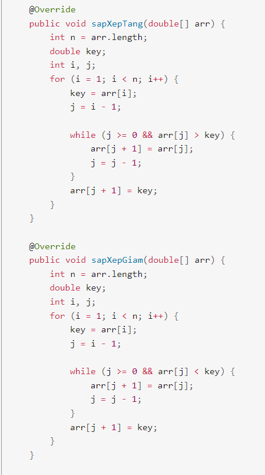

41. trong java ko có đa kế thừa

42. overriding

    - ghi đè method
    - sử dụng khi class con kế thừa từ class cha và
      muốn đ/n lại 1 method đã có ở class cha
      
      

43. overloading

    - tên method giống nhau nhưng tham số truyền vào khác nhau

    

####note

44. abstract
    
    
    

    
    
    
    
    
    

    vi du ve abstract
    

45. interface
    
    
    vd1:
    
    
    
    
    
    

46. package
47. private, protected, public, no modifile
