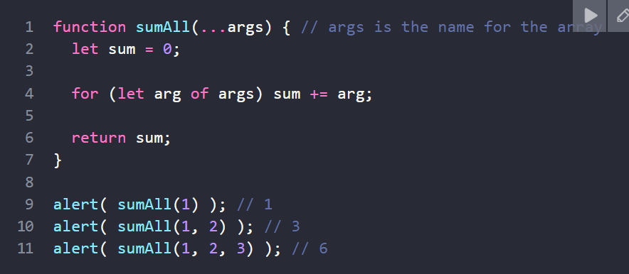
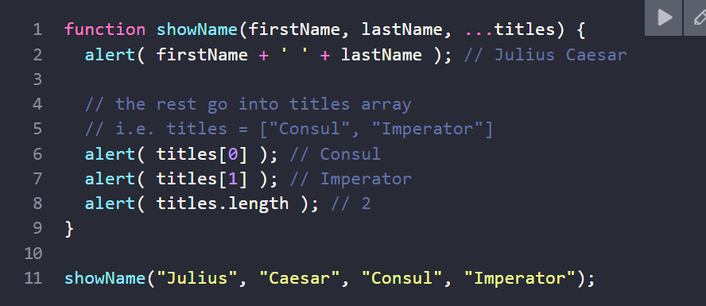
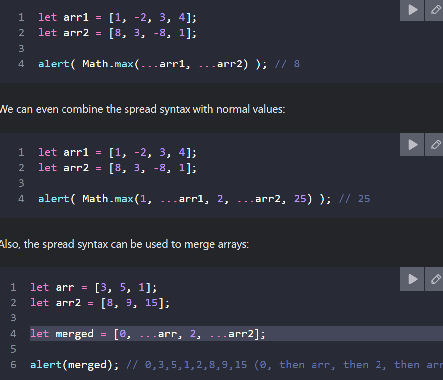
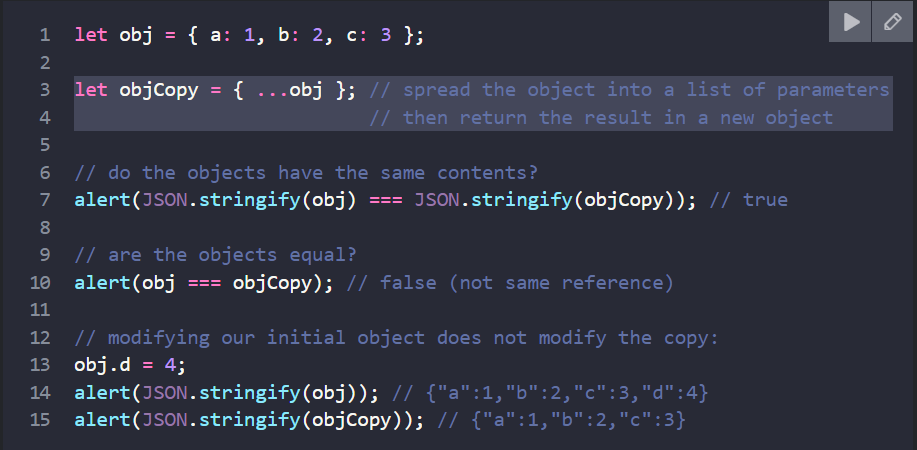
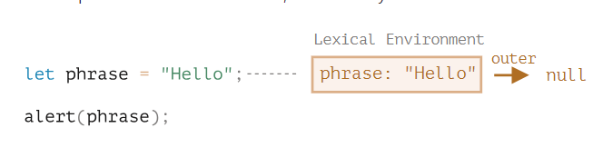

## FUNCTION PART-2
1. Recursion(đệ quy), stack
    - đệ qui là 1 pattern(khuôn mẫu) có thể hữu ích trong các tình huống khi 1 tác vụ có thể được chia thành nhiều tác vụ cùng loại [khi function giả quyết 1 task thì trong quá trình nó có thể gọi nhiều hàm khác (nó gọi lại chính nó là đệ qui)]
    - context & stack
    - recursive traversals
    - recursive structures
    - linked list

2. Rest parameters & spread syntax
    -  rest parameter(...):
    
    
        + must be at the end

    - spread: 
    
        + copy an array/object (like object.assign())
        
        

    - rest ở cuối tham số fn còn spread nằm trong lệnh gọi fn
    - rest dùng khi tạo hàm chấp nhận bất kì đối số nào còn spread dùng để truyền 1 mảng tới các hàm yru6 cầu nhiều đối số 

3. Variable scope, closure
    - code block: biến mà được định nghĩa trong {...} chỉ tồn tại bên trong khu vực đó.
    - Nested fn: fn được tạo ra bên trong 1 fn khác, có thể truy xuất biến của fn cha.
    - Lexical Environment: có 2 phần
        + environment record: là 1 object chứa tất cả các biến local làm thuộc tính của nó
        + outer lexical environment: phần liên kết với bên ngoài
        

    - closure:
    - garbage collection
    - Real-life optimizations

4. the old var
    - var has no block scope
    - var chấp nhận khai báo lại ???
    - var có hể dùng trước khi khai báo ???
    - var được hoisted
    - IIFE(): [Immediately Invoked Function Expression]: biểu thức hàm được gọi ngay lập tức

5. Global object

6. Fn Object
7. new Function
8. Scheduling
9. Decorator & forwarding
10. Fn binding
11. Arrow Fn

