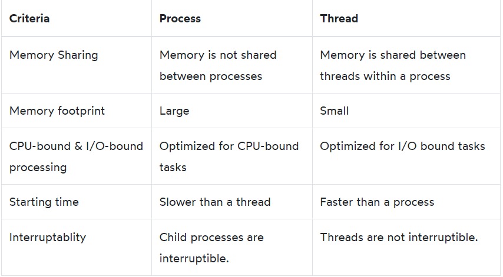

====CONCURRENCY====

# 1. Multithreading
## 1.1 Processes vs Threads
```py
# a process is an instance of a program running on a computer
# a thread is a unit of execution within a process

# a dual-core CPU can execute exactly two processes simultaneously and a quad-core CPU can execute at most four processes simultaneously
```

```py
# A process is an instance of a program running on a computer.
# A program can have one or more processes and a process can have one or more threads.
#A thread is a unit of execution within a process.
# A process can have one or more threads
```
## 1.2 Threading
```py
# Single-threaded
## program has one process with a single thread, which is called the main thread. Because the program has only one thread, it’s called a single-threaded program

# multi-threaded
from threading import Thread

new_thread = Thread(target=fn,args=args_tuple)
## target: specifies a function (fn) to run in the new thread
## args: specifies the arguments of the function (fn). The args argument is a tuple

new_thread.start()
new_thread.join()

## ex:
from time import sleep, perf_counter
from threading import Thread


def task():
    print('Starting a task...')
    sleep(1)
    print('done')


start_time = perf_counter()

# create two new threads
t1 = Thread(target=task)
t2 = Thread(target=task)

# start the threads
t1.start()
t2.start()

# wait for the threads to complete
t1.join()
t2.join()

end_time = perf_counter()

print(f'It took {end_time- start_time: 0.2f} second(s) to complete.')
## output:
### Starting a task...
### Starting a task...
### done
### done
### It took  1.00 second(s) to complete.

## => When the program executes, it’ll have three threads: the main thread and two other child threads

# Passing arguments to threads
from time import sleep, perf_counter
from threading import Thread

def task(id):
    print(f'Starting the task {id}...')
    sleep(1)
    print(f'The task {id} completed')

start_time = perf_counter()

# create and start 10 threads
threads = []
for n in range(1, 11):
    t = Thread(target=task, args=(n,))
    threads.append(t)
    t.start()

# wait for the threads to complete
for t in threads:
    t.join()

end_time = perf_counter()

print(f'It took {end_time- start_time: 0.2f} second(s) to complete.')

## output:
# Starting the task 1...
# Starting the task 2...
# Starting the task 3...
# Starting the task 4...
# Starting the task 5...
# Starting the task 6...
# Starting the task 7...
# Starting the task 8...
# Starting the task 9...
# Starting the task 10...
# The task 10 completed
# The task 8 completed
# The task 1 completed
# The task 6 completed
# The task 7 completed
# The task 9 completed
# The task 3 completed
# The task 4 completed
# The task 2 completed
# The task 5 completed
# It took  1.02 second(s) to complete.

# When to use Python threading
## Python threading is optimized for I/O bound tasks. For example, requesting remote resources, connecting a database server, or reading and writing files.

## ex: single-threaded replace a text
from time import perf_counter


def replace(filename, substr, new_substr):
    print(f'Processing the file {filename}')
    # get the contents of the file
    with open(filename, 'r') as f:
        content = f.read()

    # replace the substr by new_substr
    content = content.replace(substr, new_substr)

    # write data into the file
    with open(filename, 'w') as f:
        f.write(content)


def main():
    filenames = [
        'c:/temp/test1.txt',
        'c:/temp/test2.txt',
        'c:/temp/test3.txt',
        'c:/temp/test4.txt',
        'c:/temp/test5.txt',
        'c:/temp/test6.txt',
        'c:/temp/test7.txt',
        'c:/temp/test8.txt',
        'c:/temp/test9.txt',
        'c:/temp/test10.txt',
    ]

    for filename in filenames:
        replace(filename, 'ids', 'id')


if __name__ == "__main__":
    start_time = perf_counter()

    main()

    end_time = perf_counter()
    print(f'It took {end_time- start_time :0.2f} second(s) to complete.')       # It took 0.16 second(s) to complete.

## ex: multi-threaded replace a text
from threading import Thread
from time import perf_counter


def replace(filename, substr, new_substr):
    print(f'Processing the file {filename}')
    # get the contents of the file
    with open(filename, 'r') as f:
        content = f.read()

    # replace the substr by new_substr
    content = content.replace(substr, new_substr)

    # write data into the file
    with open(filename, 'w') as f:
        f.write(content)


def main():
    filenames = [
        'c:/temp/test1.txt',
        'c:/temp/test2.txt',
        'c:/temp/test3.txt',
        'c:/temp/test4.txt',
        'c:/temp/test5.txt',
        'c:/temp/test6.txt',
        'c:/temp/test7.txt',
        'c:/temp/test8.txt',
        'c:/temp/test9.txt',
        'c:/temp/test10.txt',
    ]

    # create threads
    threads = [Thread(target=replace, args=(filename, 'id', 'ids'))
            for filename in filenames]

    # start the threads
    for thread in threads:
        thread.start()

    # wait for the threads to complete
    for thread in threads:
        thread.join()


if __name__ == "__main__":
    start_time = perf_counter()

    main()

    end_time = perf_counter()
    print(f'It took {end_time- start_time :0.2f} second(s) to complete.')
## output:
# Processing the file c:/temp/test1.txt
# Processing the file c:/temp/test2.txt
# Processing the file c:/temp/test3.txt
# Processing the file c:/temp/test4.txt
# Processing the file c:/temp/test5.txt
# Processing the file c:/temp/test6.txt
# Processing the file c:/temp/test7.txt
# Processing the file c:/temp/test8.txt
# Processing the file c:/temp/test9.txt
# Processing the file c:/temp/test10.txt
# It took 0.02 second(s) to complete.

# Only use threading for I/O bound processing applications
```
## 1.3 Thread class
```py
# First, define a subclass of threading.Thread class.
# Second, override __init__(self, [,args]) method inside of the __init__() method of the subclass to add custom arguments.
# Third, override the run(self, [,args]) method inside of the subclass to customize the behavior of the new thread class when a new thread is created.

## ex:

class HttpRequestThread(Thread):
    def __init__(self, url: str) -> None:
        super().__init__()
        self.url = url

    # override the run method
    def run(self) -> None:
        print(f'Checking {self.url} ...')
        try:
            response = urllib.request.urlopen(self.url)
            print(response.code)
        except urllib.error.HTTPError as e:
            print(e.code)
        except urllib.error.URLError as e:
            print(e.reason)
## use the HttpRequestThread
def main() -> None:
    urls = [
        'https://httpstat.us/200',
        'https://httpstat.us/400'
    ]

    threads = [HttpRequestThread(url) for url in urls]

    [t.start() for t in threads]

    [t.join() for t in threads]

### output:
# Checking https://httpstat.us/200 ...
# Checking https://httpstat.us/400 ...
# 200
# 400
```
## 1.4 Return values from a thread
```py
# extend the Thread class and store that value in the instance of the class

## ex: check a specified URL and return its HTTP status code in a separate thread
from threading import Thread
import urllib.request


class HttpRequestThread(Thread):
    def __init__(self, url: str) -> None:
        super().__init__()
        self.url = url
        self.http_status_code = None
        self.reason = None

    def run(self) -> None:
        try:
            response = urllib.request.urlopen(self.url)
            self.http_status_code = response.code
        except urllib.error.HTTPError as e:
            self.http_status_code = e.code
        except urllib.error.URLError as e:
            self.reason = e.reason


def main() -> None:
    urls = [
        'https://httpstat.us/200',
        'https://httpstat.us/400'
    ]

    # create new threads
    threads = [HttpRequestThread(url) for url in urls]

    # start the threads
    [t.start() for t in threads]

    # wait for the threads to complete
    [t.join() for t in threads]

    # display the URLs with HTTP status codes
    [print(f'{t.url}: {t.http_status_code}') for t in threads]


if __name__ == '__main__':
    main()


def main() -> None:
    urls = [
        'https://httpstat.us/200',
        'https://httpstat.us/400'
    ]

    # create new threads
    threads = [HttpRequestThread(url) for url in urls]

    # start the threads
    [t.start() for t in threads]

    # wait for the threads to complete
    [t.join() for t in threads]

    # display the URLs with HTTP status codes
    [print(f'{t.url}: {t.http_status_code}') for t in threads]
## output:
# https://httpstat.us/200: 200
# https://httpstat.us/400: 400

# Extend the Thread class and set the instance variables inside the subclass to return the values from a child thread to the main thread
```
## 1.5 Multithreading
```py

```
## 1.6 Daemon Thread
```py
# daemon threads là background threads [execute threads in the background]
# dùng khi:
    # log info to a file in bg
    # scrap content from web pages in bg
    # auto-save data into database

# tạo daemon thread
t = Thread(target=f, daemon=True)
# ex: non-daemon thread
from threading import Thread
import time


def show_timer():
    count = 0
    while True:
        count += 1
        time.sleep(1)
        print(f'Has been waiting for {count} second(s)...')


t = Thread(target=show_timer)
t.start()

answer = input('Do you want to exit?\n')
## output:
    # Do you want to exit?Has been waiting for 1 second(s)...
    # Has been waiting for 2 second(s)...
    # Has been waiting for 3 second(s)...
    # Has been waiting for 4 second(s)...
    # Y
    # Has been waiting for 5 second(s)...
    # Has been waiting for 6 second(s)...
## explain:
    # To terminate the program, you need to kill the terminal
    # 't' sẽ chạy vô tận vì nó là non-daemon thread
    # nó sẽ chờ non-daemon hoàn thành mới làm bước tiếp theo

# Ex: daemon thread
from threading import Thread
import time


def show_timer():
    count = 0
    while True:
        count += 1
        time.sleep(1)
        print(f'Has been waiting for {count} second(s)...')


t = Thread(target=show_timer, daemon=True)
t.start()

answer = input('Do you want to exit?\n')
## output:
    # Do you want to exit?
    # Has been waiting for 1 second(s)...
    # Y
## explain:
    # program hủy vì khong cần phải đợi daemon thread hoàn thành
    # daemon thread sẽ tữ động killed khi exits

# KHÁC NHAU DAEMON VS NON-DAEMON    
## Thread creation
t = Thread(target=f, daemon=True)
vs
t = Thread(target=f)

## need to wait before exiting
No vs Yes
## kind of task
Not critical like logging vs Critical

# SUMMARY
    # là bg thread
    # dùng để làm các task ko quan trọng(no critical)
    # có thể thoát mà không cần daemon thread hoàn thành
    # tự động hủy khi thoát chương trình
```
## 1.7 Thread Pool Executor
```py
# việc quản lý các thread theo cách thủ cong thì không hiệu quả vì việc tạo và hủy nhiều thread thường xuyên sẽ tốn kém về mặt tính toán[computational cost]

# THREAD POOL
## mỗi thread trong thread pool là 1 worker thread. thread pool cho phép tái sử dụng lại worker thread

# ThreadPoolExecutor
## luôn trả về 1 Future object
## method:
    submit()    # dispatch 1 fn và return  Future object. executes async
    map()       # execute fn async for each element in an iterable
    shutdown()  # hủy executor

##  create a new instance of the ThreadPoolExecutor class, Python starts the Executor

# FUTURE OBJECT
## là 1 object đại diện cho final result của async
## method:
    result()        # get the result 
    exception()     # get the exception (if any)

# EX: with out function concurrently
from time import sleep, perf_counter

def task(id):
    print(f'Starting the task {id}...')
    sleep(1)
    return f'Done with task {id}'

start = perf_counter()

print(task(1))
print(task(2))

finish = perf_counter()

print(f"It took {finish-start} second(s) to finish.")
## output:
    # Starting the task 1...
    # Done with task 1
    # Starting the task 2...
    # Done with task 2
    # It took 2.0144479 second(s) to finish.

# EX: with fn concurrently. used submit()
from time import sleep, perf_counter
from concurrent.futures import ThreadPoolExecutor

def task(id):
    print(f'Starting the task {id}...')
    sleep(1)
    return f'Done with task {id}'

start = perf_counter()

with ThreadPoolExecutor() as executor:
    f1 = executor.submit(task, 1)
    f2 = executor.submit(task, 2)

    print(f1.result())
    print(f2.result())    

finish = perf_counter()

print(f"It took {finish-start} second(s) to finish.")
## output:
    # Starting the task 1...
    # Starting the task 2...
    # Done with task 1
    # Done with task 2
    # It took 1.0177214 second(s) to finish.

# ex: used map()
from time import sleep, perf_counter
from concurrent.futures import ThreadPoolExecutor


def task(id):
    print(f'Starting the task {id}...')
    sleep(1)
    return f'Done with task {id}'

start = perf_counter()

with ThreadPoolExecutor() as executor:
    results = executor.map(task, [1,2])
    for result in results:
        print(result)

finish = perf_counter()

print(f"It took {finish-start} second(s) to finish.")

# ex: download multiple image
from concurrent.futures import ThreadPoolExecutor
from urllib.request import urlopen
import time
import os

def download_image(url):
    image_data = None
    with urlopen(url) as f:
        image_data = f.read()

    if not image_data:
        raise Exception(f"Error: could not download the image from {url}")

    filename = os.path.basename(url)
    with open(filename, 'wb') as image_file:
        image_file.write(image_data)
        print(f'{filename} was downloaded...')

start = time.perf_counter()

urls = ['https://upload.wikimedia.org/wikipedia/commons/9/9d/Python_bivittatus_1701.jpg',
        'https://upload.wikimedia.org/wikipedia/commons/4/48/Python_Regius.jpg',
        'https://upload.wikimedia.org/wikipedia/commons/d/d3/Baby_carpet_python_caudal_luring.jpg',
        'https://upload.wikimedia.org/wikipedia/commons/f/f0/Rock_python_pratik.JPG',
        'https://upload.wikimedia.org/wikipedia/commons/0/07/Dulip_Wilpattu_Python1.jpg']

with ThreadPoolExecutor() as executor:
      executor.map(download_image, urls)

finish = time.perf_counter()    

print(f'It took {finish-start} second(s) to finish.')

# SUMMARY:
    # pattern for manage multiple thread efficiently
    # submit(), map()
```
# 2. Thread Synchronization Techniques
## 2.1 Threading Lock
```py
# race condition: xảy ra khi 2 hay nhiều thread cùng truy cập đồng thời vào 1 biến -> ko đoán được kết quả
## ex:
from threading import Thread
from time import sleep

counter = 0

def increase(by):
    global counter

    local_counter = counter
    local_counter += by

    sleep(0.1)

    counter = local_counter
    print(f'counter={counter}')


# create threads
t1 = Thread(target=increase, args=(10,))
t2 = Thread(target=increase, args=(20,))

# start the threads
t1.start()
t2.start()

# wait for the threads to complete
t1.join()
t2.join()


print(f'The final counter is {counter}')
## output:
    # counter=10
    # counter=20
    # The final counter is 20

# THREAD LOCK
## là 1 sync cung cấp quyền truy cập độc quyền vào tài nguyên trong 1 ứng dụng đa luồng
## là mutex[mutual exclusion]
## state: locked và unlocked
lock = Lock()
lock.acquire()
lock.release()

## ex: from threading import Thread, Lock
from time import sleep


counter = 0


def increase(by, lock):
    global counter

    lock.acquire()

    local_counter = counter
    local_counter += by

    sleep(0.1)

    counter = local_counter
    print(f'counter={counter}')

    lock.release()


lock = Lock()

# create threads
t1 = Thread(target=increase, args=(10, lock))
t2 = Thread(target=increase, args=(20, lock))

# start the threads
t1.start()
t2.start()


# wait for the threads to complete
t1.join()
t2.join()


print(f'The final counter is {counter}')
## output:
    # counter=10
    # counter=30
    # The final counter is 30

# ex:
import threading

# Create a lock object
lock = threading.Lock()

# Perform some operations within a critical section
with lock:
    # Lock was acquired within the with block
    # Perform operations on the shared resource
    # ...

# the lock is released outside the with block

## ex:
from threading import Thread, Lock
from time import sleep


counter = 0

def increase(by, lock):
    global counter

    with lock:
        local_counter = counter
        local_counter += by

        sleep(0.1)

        counter = local_counter
        print(f'counter={counter}')


lock = Lock()

# create threads
t1 = Thread(target=increase, args=(10, lock))
t2 = Thread(target=increase, args=(20, lock))

# start the threads
t1.start()
t2.start()


# wait for the threads to complete
t1.join()
t2.join()


print(f'The final counter is {counter}')

# ex:
from threading import Thread, Lock
from time import sleep


class Counter:
    def __init__(self):
        self.value = 0
        self.lock = Lock()

    def increase(self, by):
        with self.lock:
            current_value = self.value
            current_value += by

            sleep(0.1)

            self.value = current_value
            print(f'counter={self.value}')

def main():
    counter = Counter()
    # create threads
    t1 = Thread(target=counter.increase, args=(10, ))
    t2 = Thread(target=counter.increase, args=(20, ))

    # start the threads
    t1.start()
    t2.start()


    # wait for the threads to complete
    t1.join()
    t2.join()


    print(f'The final counter is {counter.value}')

if __name__ == '__main__':
    main()

```
3. Sharing Data Between Threads
4. Multiprocessing
5. Async I/O

====Regex====
====Unit Test====
====NumPy====

====CSS====


1. Array
```py
# lưu trữ 1 số phần tử có cùng type data
# array = [element[index], ...]
# time: O(1)
# memory: local
# ko thể thay đổi kích thước mảng khi đang chạy

# dynamic array:

# EX1:
## NHẬP VÀO N(NGUYÊN DƯƠNG) VÀ N P/TỬ TRONG DÃY A => TỔNG CỦA DÃY
n = (int)(input())
a = []
for i in range(n):
        a.append((int)(input()))
Sum = 0
for i in range(n):
        Sum+ = a[i]
print(Sum)

# EX2: NHẬP VÀO N(NGUYÊN DƯƠNG), N P/TỬ TRONG DÃY A. THAY ĐỔI G/TRỊ CỦA P/TỬ THÀNH BÌNH PHƯƠNG CỦA NÓ.
n = int(input())
a = []
for i in range(n):
        a.append(int(input()))
for i in range(n):
        a[i] *= a[i]
for i in range(n):
        print(a[i], end = ' ')

# EX3: nhập:
## N nguyên dương
## N p/tử của dãy a
## k,x (0 <= k <= n)

##  chèn x vào dãy a [k < x < k-1]
## input                # output
4                           
1 2 3 4                     1 10 2 3 4
1 10

a = int(input())
ori_list = []
result = ""

for i in range(a):
    ori_list.append(input())

k = int(input())
x = input()

for i in range(a+1):
    if i < k:
        result = result + ori_list[i] + ' '
    elif i == k:
        result = result + x + ' '
    else:
        result = result + ori_list[i-1] + ' '
print(result)
```

https://www.javascripttutorial.net/

https://www.mysqltutorial.org/

====BaSic====
1. Querying data
```sql
SELECT select_list, select_list1,...
FROM table_name;

```
2. Sorting data
3. Filtering data
4. Joining tables
5. Grouping data
6. Sub queries
7. Set operator
8. Managing database
9. Working with table
10. constraints
11. Data types
12. MOdifying data
13. Common table Expression
14. Locking
15. Globalization
16. User-define variable
17. import & export CSV
18. Adv techniques
====Adv====
1. Stored procedures
2. Conditional Statements
3. Loops
4. Error Handling
5. Cursors
6. Stored Function
7. Stored Program Security
8. Transaction
9. Trigger
10. Event
11. Views
12. Index
    1. Creating and Managing
    2. Index Types
    3. INdex Hints
13. Json
    1. search json document
    2. Modifying Json document
    3. querying Json document
    4. Json array
    5. Aggregating Json Data
    6. index Json data
    7. Getting attribute Json value
    8. Json table fn
    9. validation fn
    10. utility fn
14. Full-text search
====Administration====
==== Function====
====API====
1. python
2. Nodejs

https://react-tutorial.app/app.html

https://www.tutorialspoint.com/reactjs/reactjs_pagination.htm

https://www.javazerotomastery.com/